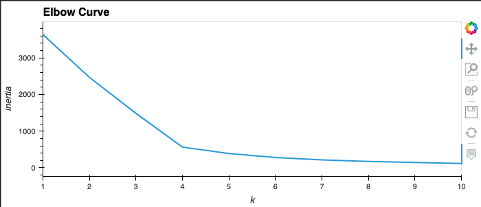
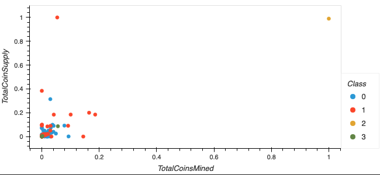

# Cryptocurrencies

## 1. Overview of the Cryptocurrencies Analysis

The purpose of this project is to use unsupervised machine learning to analyze a database of cryptocurrencies and create a report including the traded cryptocurrencies classified by group according to their features.

## 2. Results:

### 2.1 Clustering Cryptocurrencies using K-Means - Elbow Curve

  

* We produced the elbow curve below using the K-Means method iterating on k values from 1 to 10.
* The best k value appears to be 4 so we would conclude on an output of 4 clusters to categorize the crytocurrencies.

### 2.2 3D-Scatter plot with clusters

  

* This 3-D scatter plot was obtained using the PCA algorithm to reduce the crytocurrencies dimensions to three principal components.

### 2.3 2D-Scatter plot with clusters

  

* Plotting the scatter plot from two cryptocurrency features directly does not efficiently segregate the different classes. 

## 3.Summary

We have identified the classification of 532 cryptocurrencies based on similarities of their features, each group need to be analyzed to determined their performance and potential interest for the investment bank's clients.
